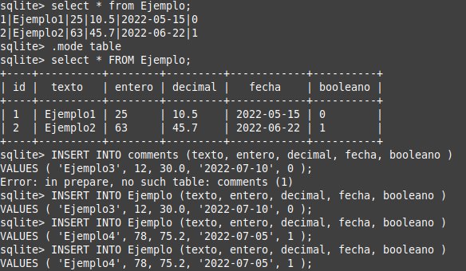
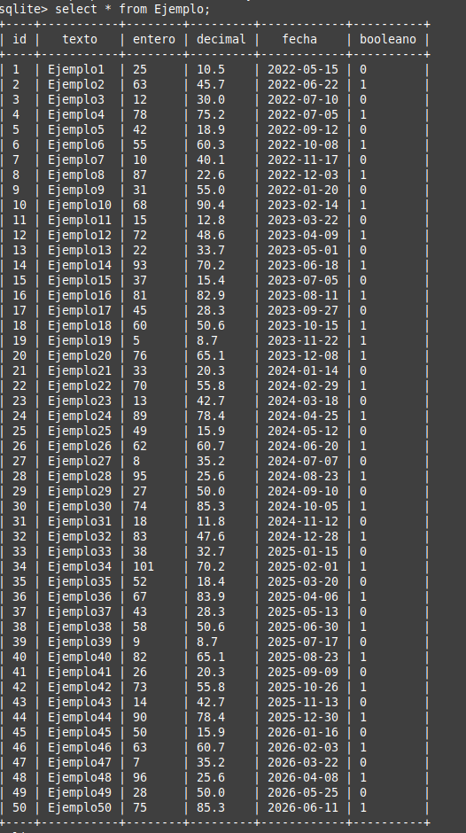
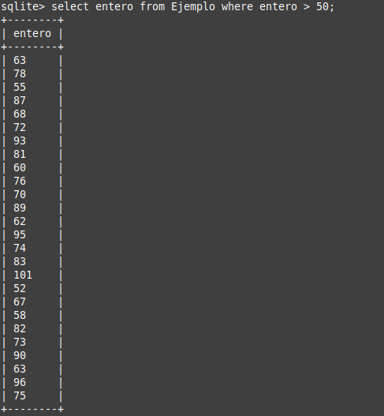

# Primeros pasos SQL

## Creamos una tabla
#### Primero creamos nuestra tabla usando los comandos adecuados:
```
create table Ejemplo (
	 texto text not null primary key autoincrement,
	 entero integer not null,
     decimal decimal not null,
     fecha text not null,
     booleano boolean not null,
);
```
Una vez creada la tabla comenzamos a insertar los datos.

Cada entrada debe ponerse de la siguiente forma:
```
insert into Ejemplo( texto, entero, decimal, fecha, booleano )
VALUES('Ejemplo', 12, 30.0, '2022-07-10', 0);
```
Así quedaría nuestra tabla tras insertar datos:



## Consultas
### obten todas las entradas:
#### las entradas se obtinen con el siguiente comando.
```
select * from Ejemplo;
```

### Obten las entradas con el campo entero mayor que 50.
#### Para realizar esta consulta debemos poner el siguiente comando:
```
select entero from Ejemplo where entero > 50;
```

